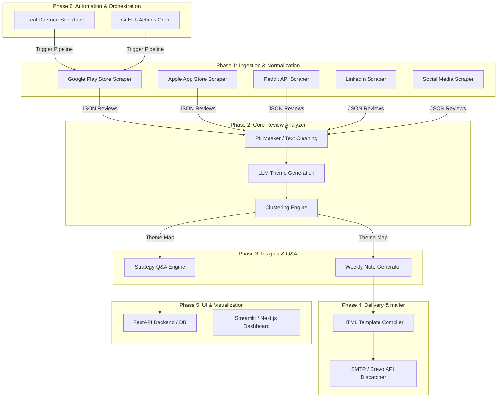
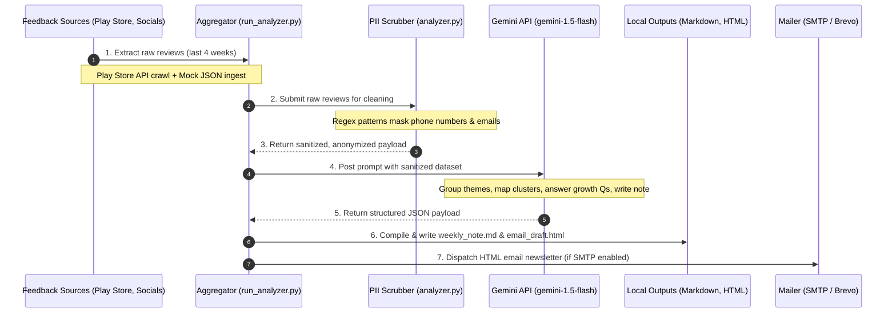

# Architecture Design: Ownly Review Analyzer

This document defines the technical architecture, directory layouts, schemas, and data flow for the **Ownly Review Analyzer**—an automated pipeline designed to ingest, clean, analyze, and distribute customer and delivery partner feedback for Rapido's zero-commission food delivery app, **Ownly**.

---

## 1. Core Architecture Blueprint

The Ownly Review Analyzer is structured as a modular, decoupled pipeline across 6 distinct operational phases:



### 1.1 Phase Status at a Glance

| Phase | Core Objective | Key Directories & Files | Implementation Status |
| --- | --- | --- | --- |
| **Phase 1: Ingestion** | Ingest reviews from Play Store, App Store, Reddit, LinkedIn, Twitter | `data/mock_reviews.json` | Play Store scraper functional; other sources integrated via mock feeds |
| **Phase 2: Core Analyzer** | Clean data, scrub email/phone PII, run Gemini dynamic theme clustering | `phase2_llm/analyzer.py` | **Fully Implemented** |
| **Phase 3: Insights** | Generate strategic answers and weekly one-page reports | `weekly_note.md` generation | **Fully Implemented** |
| **Phase 4: Delivery** | Compile HTML newsletter and dispatch via SMTP / Brevo | `email_draft.html` compiler | **Fully Implemented** (SMTP mailer active) |
| **Phase 5: UI & Dashboard** | Streamlit / Next.js feedback and theme visualization dashboard | `phase5_ui/` | *Roadmap Phase* |
| **Phase 6: Automation** | Schedule pipeline weekly via local daemon or GitHub Action | `phase6_automation/` | *Roadmap Phase* |

### 1.2 High-Level Data Flow Sequence

The following sequence diagram outlines the chronological flow of data, transformation states, and output generation within the review analysis system:



---

## 2. Directory Layout & Module Structure

```
ownly_review_analyzer/
├── ARCHITECTURE.md            # System architecture details (this file)
├── README.md                  # Quickstart and run instructions
├── requirements.txt           # Dependency declaration
├── .env.example               # Configuration template
├── .env                       # Local secrets (GEMINI_API_KEY, SMTP details)
├── run_analyzer.py            # Primary CLI execution runner
│
├── data/
│   └── mock_reviews.json      # Pre-populated reviews from App Store, Reddit, etc.
│
├── phase1_ingestion/          # INGESTION LAYER
│   ├── __init__.py
│   └── ingestor.py            # Handles scrapers (Play Store, App Store, Mock APIs)
│
├── phase2_llm/                # LLM & ANALYSIS LAYER
│   ├── __init__.py
│   └── analyzer.py            # PII masking, theme clustering, HTML generation
│
├── phase3_insights/           # STRATEGIC INSIGHTS LAYER (Future)
│   ├── __init__.py
│   └── strategist.py          # Detailed query processing and growth ideas
│
├── phase4_delivery/           # EMAIL DELIVERY LAYER (Future)
│   ├── __init__.py
│   └── mailer.py              # Brevo API / SMTP mail dispatch logic
│
├── phase5_ui/                 # USER INTERFACE LAYER (Future)
│   ├── __init__.py
│   ├── app.py                 # FastAPI backend
│   └── dashboard.py           # Streamlit frontend
│
└── phase6_automation/         # CRON / SCHEDULER LAYER (Future)
    ├── __init__.py
    └── orchestrator.py        # Local time checker and scheduler loop
```

---

## 3. Detailed Phase Breakdown

### Phase 1: Ingestion & Normalization (`phase1_ingestion/`)
*   **Purpose**: Gathers feedback from multiple channels, normalizes fields, and filters to the last 4 weeks.
*   **Target Identifiers**:
    *   *Google Play Store*: Package `com.ctrlx.ownly`
    *   *Apple App Store*: ID `6739922216`
    *   *Reddit, LinkedIn, Twitter*: Contextual keyword crawls (`#Ownly`, `Ownly app`, `Ownly Rapido`).
*   **Data Schema (Normalized Review Object)**:
    ```json
    {
      "source": "playstore | appstore | reddit | linkedin | twitter",
      "rating": 1, // 1-5 integer, or null for social media
      "title": "Short Header", // String or null
      "text": "Full review body text...",
      "date": "YYYY-MM-DDTHH:MM:SSZ" // ISO UTC timestamp
    }
    ```

### Phase 2: Core Review Analyzer (`phase2_llm/`)
*   **Purpose**: Preprocesses feedback, scrubs PII, discovers themes, and clusters reviews.
*   **PII Masking Rules**:
    *   *Emails*: Regex `[\w\.-]+@[\w\.-]+\.\w+` replaced with `[EMAIL]`.
    *   *Phone Numbers*: Regex `(?:\+?91[\s-]?)?[6-9]\d{4}[\s-]?\d{5}\b|\b\d{10}\b` replaced with `[PHONE]`.
    *   *Names*: Prompt-guided filtering to redact personal names (e.g. Ramesh, John) and exact addresses.
*   **Theme Generation**:
    *   Calls the Gemini LLM (`gemini-1.5-flash` or similar) to define exactly **3 to 5 high-level themes** that encapsulate the reviews.
    *   *Constraint*: Must dynamically group, not hardcode, themes.
*   **Clustering**: Assigns every review to a generated theme ID.

### Phase 3: Insights & Strategy (`phase3_insights/`)
*   **Purpose**: Creates the strategic report answering specific business questions:
    1.  *Struggle Points*: App UI bugs, lag, search engine indexing.
    2.  *Ordering Frustrations*: Payment failures, order cancellations, delayed deliveries.
    3.  *Delivery Partner & User Issues*: Route tracking inaccuracies, distance payouts, app crashes.
    4.  *Competitor Switching & Loyalty*: Causes for switching back to Zomato/Swiggy (e.g., poor customer support, missing call button).
    5.  *Discovery Challenges*: App Store search optimizations, search keywords.
    6.  *Unmet Needs*: Pre-booking, corporate invoices (GST), multi-restaurant order carts.
*   **Output Product**: A **Weekly One-Page Note** comprising:
    -   Top 3 themes.
    -   3 raw user quotes (scrubbed).
    -   3 action ideas.

### Phase 4: Delivery (`phase4_delivery/`)
*   **Purpose**: Compiles a professional HTML email with the insights and drafts/sends it.
*   **Delivery Infrastructure**:
    *   *SMTP Path*: `smtp.gmail.com` via Port 465 (using app passwords).
    *   *API Path (Production)*: Brevo API Integration using HTTP requests (to bypass SMTP port blocks on cloud hosts like Railway).

### Phase 5: UI & Dashboard (`phase5_ui/`)
*   **Purpose**: visual interface for restaurant owners and product managers.
*   **Dashboard Features**:
    -   Theme breakdown pie chart.
    -   Review feed filtered by source, rating, or theme.
    -   Growth/action idea tracking board.
    -   Downloadable reports (PDF / CSV).

### Phase 6: Automation & Orchestration (`phase6_automation/`)
*   **Purpose**: Triggers the entire pipeline weekly on a defined day (e.g., Tuesday 10 AM UTC).
*   **Automation Types**:
    1.  *Local Orchestrator*: Continuously running daemon checking time using `pytz.timezone('Asia/Kolkata')`.
    2.  *GitHub Actions*: Workflow file `.github/workflows/weekly_audit.yml` triggered via cron schedules.

---

## 4. LLM API Payload Contract

The LLM is prompted to return a valid JSON payload matching this exact schema:

```json
{
  "themes": [
    {
      "id": "theme_commission_fees",
      "name": "Zero-Commission Sustainability",
      "description": "Feedback related to how the zero-commission model works and restaurant margins."
    }
  ],
  "clustering": [
    {
      "review_index": 1,
      "theme_id": "theme_commission_fees"
    }
  ],
  "question_answers": {
    "struggle_points": "Answer...",
    "ordering_frustrations": "Answer...",
    "delivery_partner_and_user_issues": "Answer...",
    "switch_causes_and_loyalty_barriers": "Answer...",
    "discovery_challenges": "Answer...",
    "unmet_needs": "Answer..."
  },
  "weekly_note": {
    "top_themes": [
      {
        "rank": 1,
        "name": "Zero-Commission Sustainability",
        "rationale": "High volume of posts and questions concerning restaurant model sustainability."
      }
    ],
    "user_quotes": [
      "The zero commission structure is great, but the onboarding process is incredibly slow.",
      "Review quote 2...",
      "Review quote 3..."
    ],
    "action_ideas": [
      "Simplify the restaurant merchant onboarding dashboard.",
      "Action 2...",
      "Action 3..."
    ]
  }
}
```

---

## 5. Security & PII Protection Standards

1.  **Double-Shield Approach**:
    -   *Shield 1 (Regex)*: Input content is passed through regex checks in Python to immediately replace emails and phone numbers.
    -   *Shield 2 (LLM Instruction)*: Prompt rules strictly forbid printing user/driver names, exact locations, or metadata in quotes, theme explanations, or answers.
2.  **No Storage of Identifiers**: The system database (`reviews.db`) and markdown files must store ONLY anonymized strings.
