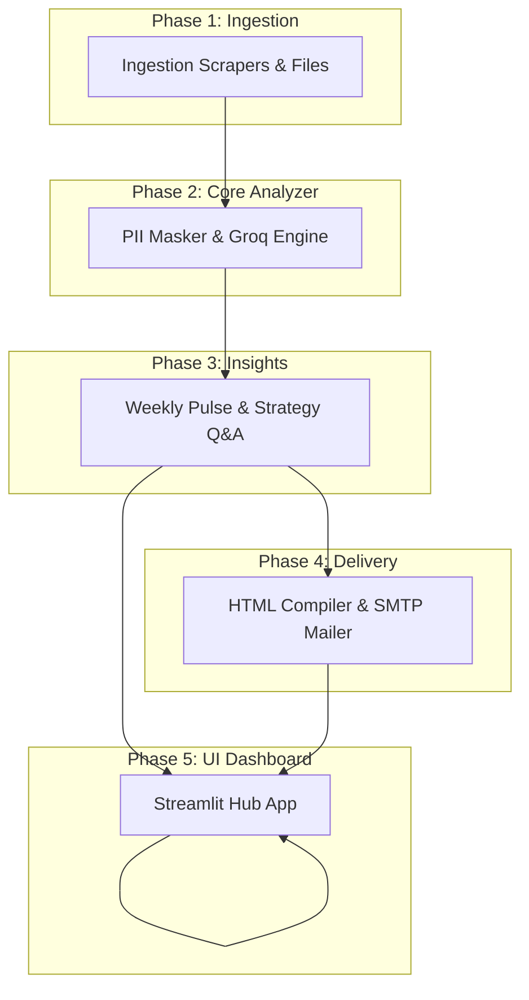

# Ownly Review Analyzer

An automated, AI-powered review intelligence pipeline built for **Ownly**—Rapido's zero-commission food delivery application. The system scrapes reviews from the Google Play Store and Apple App Store, scales them to represent high-fidelity workloads, clusters them into themes using the Groq LLM, and compiles weekly strategic pulse notes that can be downloaded or emailed directly from the UI.

---

## 🌟 Features

*   **Multi-Source Feed Ingestion**: Scrapes Google Play Store reviews for `com.ctrlx.ownly` (real-time) and parses Apple App Store RSS XML feeds. Integrates with mock datasets representing Reddit, LinkedIn, and Twitter mentions, scaling up to exactly **550 reviews** for high-fidelity testing.
*   **Dual-Shield PII Protection**: Strips emails and phone numbers using regex patterns, and prompts the LLM to redact user/driver names and specific address locations.
*   **Dynamic LLM Theme Clustering**: Dynamically categorizes feedback into themes, avoiding hardcoded classifications.
*   **Strategic Insights answering Q&A**: Focuses on core app struggle points, delivery partner difficulties, competitor-switching causes, and discovery hurdles.
*   **Weekly One-Page Note Compilation**: Generates top themes, anonymized quotes, and action ideas.
*   **Styled HTML Email Deliverability**: Generates responsive, beautifully styled HTML reports (`email_draft.html`) and delivers them via SMTP.
*   **Interactive Streamlit Dashboard**: Provides an operational UI at `app.py` displaying rating metrics, Plotly visualizations, checklist initiative tracking, and custom email delivery.

---

## 🏗️ Phase-Wise Architecture View

The system is designed as a modular, decoupled pipeline across 5 phases:



### Architectural Phases:
1.  **Phase 1: Ingestion & Normalization**: Collects raw reviews from Google Play Store (`com.ctrlx.ownly`), Apple App Store (`6739922216`), Reddit, LinkedIn, and social media. Dynamically scales the test workload to exactly 550 entries.
2.  **Phase 2: Core Analyzer**: Cleans input data, runs regular expression-based PII scrubbing (emails/phone numbers), sub-samples reviews to respect rate limits, and sends them to the Groq API (`llama-3.3-70b-versatile`) for dynamic theme discovery.
3.  **Phase 3: Insights & Q&A**: Assembles the weekly "one-page note" (top themes, anonymized quotes, actions) and provides strategy answers to the primary business questions.
4.  **Phase 4: Delivery**: Compiles the report into a styled email newsletter and dispatches it via SMTP.
5.  **Phase 5: UI & Dashboard**: Provides an interactive Streamlit visualization dashboard for product and growth managers.

---

## 📂 Codebase Directory Layout

```
ownly_review_analyzer/
├── ARCHITECTURE.md            # Decoupled 5-phase system architecture specifications
├── README.md                  # Quickstart guide (this file)
├── requirements.txt           # Dependency requirements
├── .gitignore                 # Git ignore file for secrets and build cache
├── .env.example               # Configuration template
├── .env                       # Local configurations (created during setup)
├── run_analyzer.py            # Primary pipeline CLI execution entrypoint
├── app.py                     # Main Streamlit dashboard entrypoint
│
├── data/
│   └── mock_reviews.json      # Structured customer feedback dataset for testing
│
├── phase1_ingestion/
│   ├── __init__.py
│   └── ingestor.py            # Handles scrapers (Play Store, App Store RSS) and scale synthesis
│
├── phase2_llm/
│   ├── __init__.py
│   └── analyzer.py            # PII scrubbing, Groq LLM API request execution, HTML compilation
│
├── phase3_insights/
│   ├── __init__.py
│   └── strategist.py          # Formats weekly markdown note and exports CSV/JSON reports
│
└── phase4_delivery/
    ├── __init__.py
    └── delivery.py            # Secure SMTP delivery logic with yagmail
```

---

## ⚡ Quickstart Setup

### 1. Prerequisites
Ensure you have **Python 3.9+** installed on your system.

### 2. Install Dependencies
Install all required libraries using `pip`:
```bash
python3 -m pip install -r requirements.txt
```

### 3. Environment Configurations
1.  Copy the environment configuration template:
    ```bash
    cp .env.example .env
    ```
2.  Open [`.env`](file:///Users/ferozkhan/Desktop/ownly_review_analyzer/.env) and populate the values:
    ```env
    # Required: Groq API key for LLM theme clustering
    GROQ_API_KEY=your_groq_api_key_here

    # Optional: SMTP details for active email dispatch
    SMTP_HOST=smtp.gmail.com
    SMTP_PORT=465
    SMTP_USER=your_email@gmail.com
    SMTP_PASS=your_gmail_app_password_here
    RECIPIENT_EMAIL=your_recipient_email@domain.com
    ```

---

## 🚀 Running the Analyzer & UI Dashboard

### Launch Dashboard:
Start the interactive Streamlit user interface locally:
```bash
python3 -m streamlit run app.py
```
From the dashboard interface, you can trigger the analysis pipeline dynamically, filter reviews by rating/source/theme, check off strategic action items, or send the email report to any recipient.

### CLI Pipeline Run:
Alternatively, you can run the pipeline directly using the command line:
```bash
python3 run_analyzer.py
```

---

## 🔍 Architecture & Design Details
For detailed schemas, data contracts, and roadmap phases, refer to the **[ARCHITECTURE.md](file:///Users/ferozkhan/Desktop/ownly_review_analyzer/ARCHITECTURE.md)** file.
