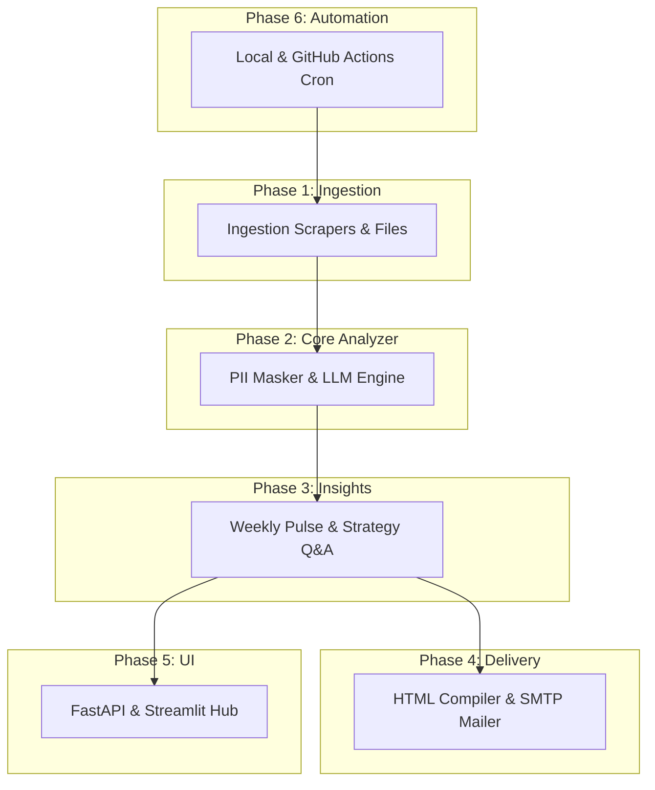

# Ownly Review Analyzer

An automated, AI-powered review intelligence pipeline built for **Ownly**—Rapido's zero-commission food delivery application. The system scrapes real-time reviews from the Google Play Store, merges them with social media and App Store feedback, clusters them into themes using LLMs, and compiles weekly strategic pulse notes delivered via email.

---

## 🌟 Features

*   **Multi-Source Feed Ingestion**: Scrapes Google Play Store reviews for `com.ctrlx.ownly` (real-time) and integrates with mock datasets representing App Store, Reddit, LinkedIn, and Twitter mentions.
*   **Dual-Shield PII Protection**: Strips emails and phone numbers using regex patterns, and prompts the LLM to redact user/driver names and specific address locations.
*   **Dynamic LLM Theme Clustering**: Dynamically categories feedback into 3–5 themes, avoiding hardcoded classifications.
*   **Strategic Insights answering Q&A**: Focuses on core app struggle points, delivery partner difficulties, competitor-switching causes, and discovery hurdles.
*   **Weekly One-Page Note Compilation**: Generates top themes, anonymized quotes, and action ideas.
*   **Styled HTML Email Deliverability**: Generates responsive, beautifully styled HTML reports (`email_draft.html`) and delivers them via SMTP.

---

## 🏗️ Phase-Wise Architecture View

The system is designed as a modular, decoupled pipeline across 6 phases:



### Architectural Phases:
1.  **Phase 1: Ingestion & Normalization**: Collects raw reviews from Google Play Store (`com.ctrlx.ownly`), Apple App Store (`6739922216`), Reddit, LinkedIn, and social media. Filters to the last 4 weeks.
2.  **Phase 2: Core Analyzer (Currently Implemented)**: Cleans input data, runs regular expression-based PII scrubbing (emails/phone numbers), and sends reviews to the Gemini LLM for dynamic theme discovery and review clustering.
3.  **Phase 3: Insights & Q&A**: Assembles the weekly "one-page note" (top themes, anonymized quotes, actions) and provides strategy answers to the primary business questions.
4.  **Phase 4: Delivery**: Compiles the report into a styled email newsletter and dispatches it via SMTP / Brevo API.
5.  **Phase 5: UI & Dashboard**: Provides a Streamlit visualization dashboard for product and growth managers.
6.  **Phase 6: Automation & Orchestration**: Automates the pipeline running weekly (Tuesdays) via a local daemon or GitHub Actions workflow.

---

## 📂 Codebase Directory Layout

```
ownly_review_analyzer/
├── ARCHITECTURE.md            # Decoupled 6-phase system architecture specifications
├── README.md                  # Quickstart guide (this file)
├── requirements.txt           # Dependency requirements
├── .env.example               # Configuration template
├── .env                       # Local configurations (created during setup)
├── run_analyzer.py            # Primary pipeline CLI execution entrypoint
│
├── data/
│   └── mock_reviews.json      # Structured customer feedback dataset for testing
│
└── phase2_llm/
    ├── __init__.py
    └── analyzer.py            # Core logic (PII scrubbing, LLM prompts, HTML newsletter compiler)
```

---

## ⚡ Quickstart Setup

### 1. Prerequisites
Ensure you have **Python 3.9+** installed on your system.

### 2. Install Dependencies
Install all required libraries using `pip`:
```bash
python3 -m pip install -r requirements.txt
```

### 3. Environment Configurations
1.  Copy the environment configuration template:
    ```bash
    cp .env.example .env
    ```
2.  Open [`.env`](file:///Users/ferozkhan/Desktop/ownly_review_analyzer/.env) and populate the values:
    ```env
    # Required: Gemini API key for LLM theme clustering
    GEMINI_API_KEY=your_gemini_api_key_here

    # Optional: SMTP details for active email dispatch
    SMTP_HOST=smtp.gmail.com
    SMTP_PORT=465
    SMTP_USER=your_email@gmail.com
    SMTP_PASS=your_gmail_app_password_here
    RECIPIENT_EMAIL=your_recipient_email@domain.com
    ```

---

## 🚀 Running the Analyzer

Run the pipeline using the command line:
```bash
python3 run_analyzer.py
```

### Script Execution Logic:
1.  **Ingests Play Store reviews** for `com.ctrlx.ownly` from the last 4 weeks.
2.  **Loads App Store, Reddit, LinkedIn, and Twitter feedback** from `data/mock_reviews.json`.
3.  **Applies PII scrubbing** to clean emails and phone numbers.
4.  **Processes with Gemini LLM** to analyze, group themes, and generate strategic action items.
5.  **Outputs files**:
    *   [`weekly_note.md`](file:///Users/ferozkhan/Desktop/ownly_review_analyzer/weekly_note.md): Markdown note detailing top themes, user quotes, and action items.
    *   [`email_draft.html`](file:///Users/ferozkhan/Desktop/ownly_review_analyzer/email_draft.html): A premium, ready-to-view email report template.
6.  **Dispatches email**: If SMTP details are completed, it sends the HTML report to the recipient.

---

## 🔍 Architecture & Design Details
For detailed schemas, data contracts, and roadmap phases, refer to the **[ARCHITECTURE.md](file:///Users/ferozkhan/Desktop/ownly_review_analyzer/ARCHITECTURE.md)** file.
